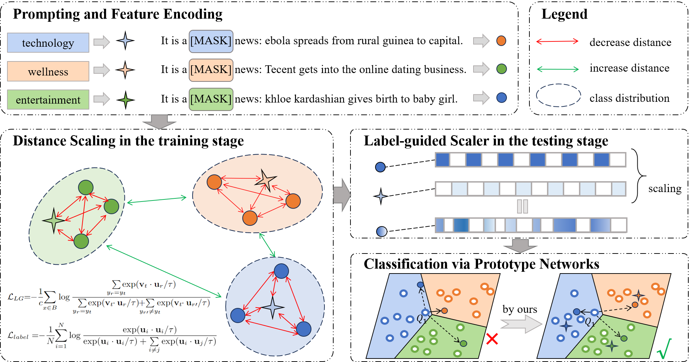

# Boosting Meta-Learning for Few-Shot Text Classification via Label-guided Distance Scaling

## Create python env

```
conda create -n LDS python=3.7
source activate LDS
pip install requirements.txt -r
```

## Model



## Data
```
cd data
unzip data.zip
```

## Quick start

```
cd scripts
sh ours_all.sh
```
The specific parameters in the paper are consistent with ours_all.sh.

**Noting:** before you start, you should download bert-base-uncased from https://huggingface.co/google-bert/bert-base-uncased, and change the path in the ours_all.sh file to your own file path.

## Citation

```
@article{LIU2025111497,
title = {Guiding Prototype Networks with label semantics for few-shot text classification},
journal = {Pattern Recognition},
volume = {164},
pages = {111497},
year = {2025},
issn = {0031-3203},
doi = {https://doi.org/10.1016/j.patcog.2025.111497},
}
```